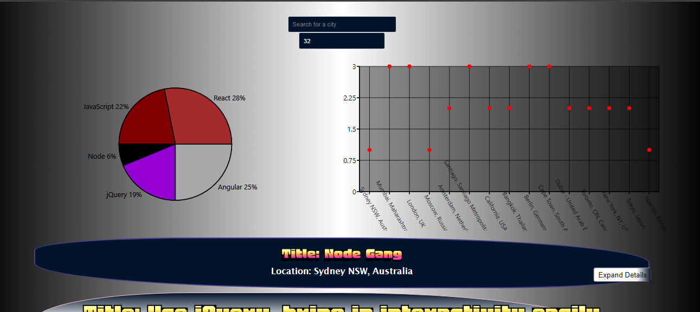

# Meet App

A serverless, progressive web application (PWA) with React using a test-driven development (TDD) technique.

## Table of Contents

- [Screenshots](#screenshots)
- [Serverless Functions](#serverless-functions)
- [Features](#features)
- [Prerequisites](#prerequisites)
- [API](#api)
- [Installation](#installation)
- [Usage](#usage)
- [Contributing](#contributing)
- [License](#license)

## Screenshots

## Serverless Functions
This app uses serverless functions for authorizing access to public calendar events from the Google Calendar API. The user enters a key and secret to ask for an access token from the authorization server. The server informs the user with a consent screen. When the user agrees by logging into their Google account and giving consent, the app can fetch and show the calendar events.

## Features

- Connects to Google's Calendar API to showcase events from any calendar.
- Filter by Location
- Change number of events
- View graphs that change based on filter criteria

### Prerequisites

To run this MeetApp, you need a web browser with JavaScript enabled. Other dependencies are listed under
package.json.

## API
The application uses the Google Calendar API to fetch upcoming events.

### Installation

1. Clone or download the repository to your local machine.
2. install all dependencies
3. run npm start or expo start

Alternatively:
1. open up the website link: https://lazyjinn1.github.io/MeetApp/

## Usage

1. Start viewing the events that load up 
2. Click Expand details to show more information on the event
3. Play around with the location and number of events filters
4. See changes in real-time.
5. Go offline to test the app's offline features and connectivity.

## Contributing

Contributions to the MeetApp are welcome! If you have any suggestions, bug fixes, or feature enhancements, feel free to open an issue or submit a pull request.

Before contributing, please review the [Code of Conduct](CODE_OF_CONDUCT.md).

## License

MeetApp is an open-source software licensed under the [MIT License](LICENSE).
